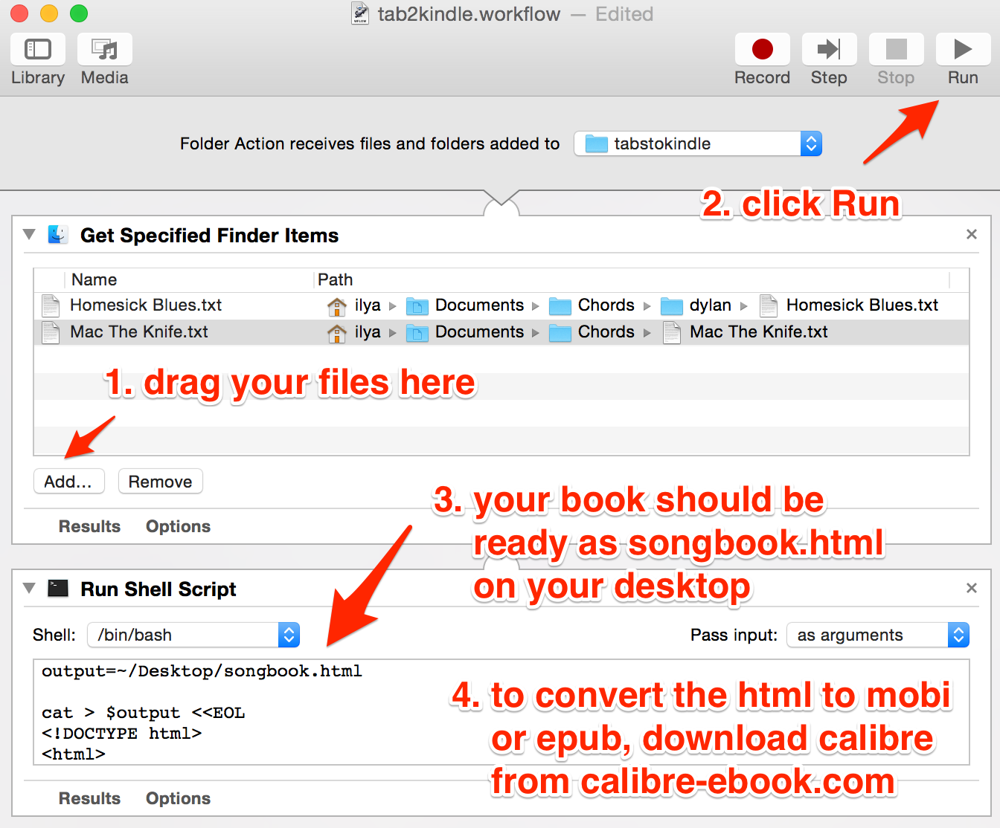

# tab2kindle
Convert a set of monospaced text files to an HTML page that can be loaded on ebook readers. Ideal for guitar chord and tab files.

This is an Automator script, so it only works on a Mac.

## Instructions

1. Download the Automator workflow file document.wflow and open it
2. Drag your files into the "Get Specified Finder Items" box (or use the Add button)
3. Click the Run button
4. Your book should now appear on your desktop as songbook.html (to compile it at a different location, change the output variable in the shell script)
5. Download and install Calibre from https://calibre-ebook.com/
6. Drag songbook.html into Calibre
7. Select the songbook and click on the Convert Books button from toolbar
8. Choose the output format (mobi for kindle, epub for other devices) and click OK
9. Connect your kindle and click Send To Device
